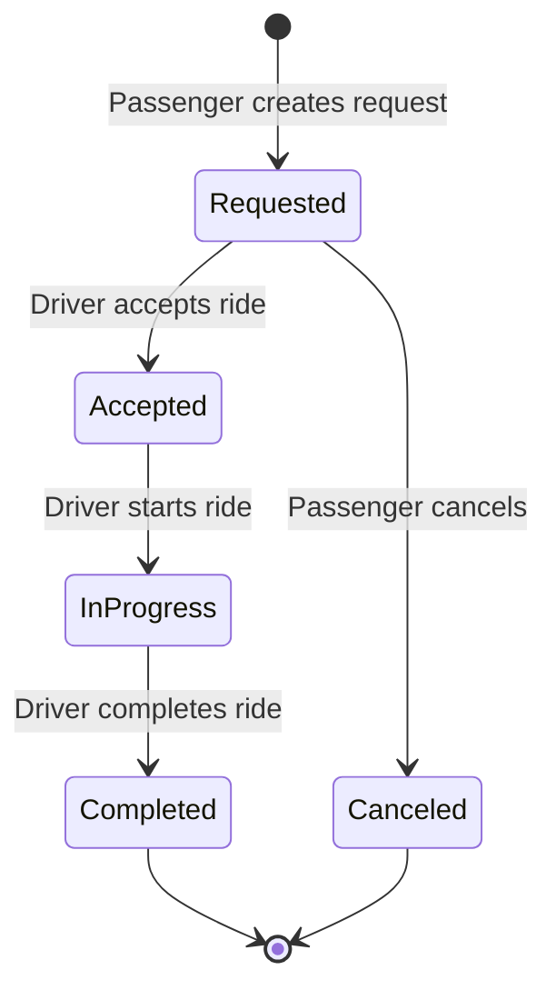

# QuantumRide Blockchain Ridesharing

A decentralized ride-sharing platform built on the Stacks blockchain that connects drivers directly with passengers without intermediaries.

## Overview

QuantumRide revolutionizes ride-sharing by eliminating traditional middlemen through blockchain technology. The platform enables:

- Direct peer-to-peer ride arrangements
- Automated payment settlement
- Transparent reputation management
- Reduced fees (5% vs traditional 20-30%)
- Trustless interactions between drivers and passengers

## Architecture

The QuantumRide system is built around a central smart contract that manages the entire ride lifecycle, from request to completion.



### Core Components:
- Ride Management System
- Payment Processing
- Reputation System
- Rating Mechanism
- Fee Management

## Contract Documentation

### Main Contract: quantum-ride.clar

#### Core Features:
- Ride request creation and management
- Driver-passenger matching
- Automated payment processing
- Reputation tracking
- Rating system
- Platform fee management

#### Access Control:
- Passengers can create and cancel rides
- Drivers can accept and complete rides
- Both parties can rate each other
- Only contract owner can withdraw platform fees

## Getting Started

### Prerequisites
- Clarinet
- Stacks wallet
- STX tokens for transactions

### Basic Usage

1. Create a ride request:
```clarity
(contract-call? .quantum-ride request-ride "123 Main St" "456 Park Ave" u50000000)
```

2. Accept a ride (as driver):
```clarity
(contract-call? .quantum-ride accept-ride u1)
```

3. Start the ride (as driver):
```clarity
(contract-call? .quantum-ride start-ride u1)
```

4. Complete the ride (as driver):
```clarity
(contract-call? .quantum-ride complete-ride u1)
```

5. Rate the ride:
```clarity
(contract-call? .quantum-ride rate-ride u1 u5)
```

## Function Reference

### Public Functions

#### Ride Management
- `request-ride (pickup-location destination fare-amount) → response`
- `accept-ride (ride-id) → response`
- `start-ride (ride-id) → response`
- `complete-ride (ride-id) → response`
- `cancel-ride (ride-id) → response`

#### Rating System
- `rate-ride (ride-id rating) → response`

#### Platform Management
- `withdraw-platform-fees (recipient) → response`

### Read-Only Functions
- `get-ride (ride-id) → (optional ride-data)`
- `get-user-reputation (user) → reputation-data`
- `get-platform-fees () → uint`

## Development

### Testing
1. Install Clarinet
2. Clone the repository
3. Run tests:
```bash
clarinet test
```

### Local Development
1. Start Clarinet console:
```bash
clarinet console
```

2. Deploy contract:
```bash
clarinet deploy
```

## Security Considerations

### Key Security Features
- Locked payment during rides
- State transition validation
- Access control checks
- Rating validation
- Double-rating prevention

### Best Practices
1. Always verify ride completion before payment release
2. Check ride state before actions
3. Verify fare amounts are reasonable
4. Ensure sufficient STX balance before requesting rides

### Limitations
- No dispute resolution mechanism
- Requires trust in location reporting
- No ride duration validation
- No dynamic pricing mechanism